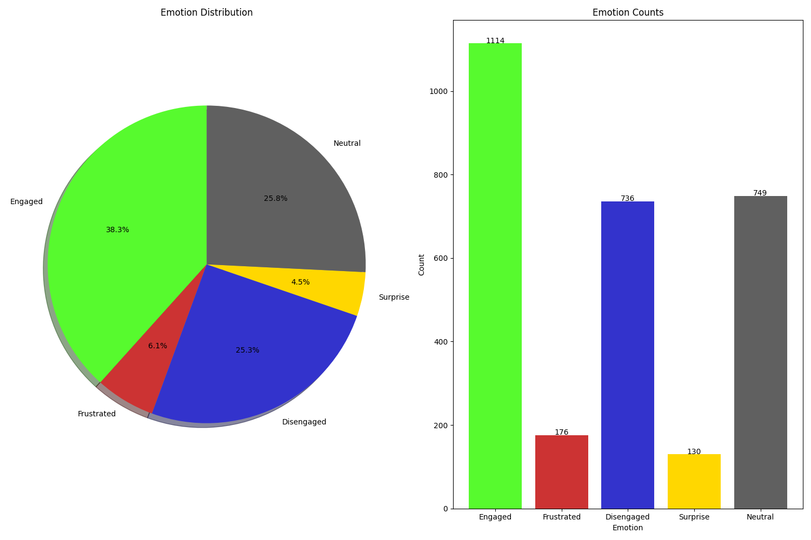

# 🎓 Student Engagement FER System

<p align="center">
  
  
  
  
</p>

A real-time **Facial Emotion Recognition (FER)** system that detects and analyzes student emotions during learning sessions. The model classifies facial expressions into:

> **Engaged, Disengaged, Surprise, Neutral, and Frustration**

The system uses your webcam to detect faces and apply a **color-coded bounding box** that reflects the detected emotion. At the end of a session, it generates a **summary of emotional trends** over the duration.

---

## 📸 Example of Working Model


---

## 📁 Project Structure

```text
FER_Model_CNN_Project/
│
├── Emotion_program.ipynb                  # Real-time detection via webcam
├── Models_Evaluation_Finished_CNN.ipynb   # Builds and saves the CNN model
├── fer2013_data.zip                       # The data the model is being trained on
├── images.ipynb                           # Gives a visualization of the models graphical analysis
├── deploy.prototxt                        # Facial Recognition software(Model Architeciture)
├── res10_300x300.caffemodel               # Facial Recognition software (trained weights)
├── emotion_recognition_metadata           # Stores metadata for the Emotion_program.ipynb
├── images/                                # Demo GIFs, session summaries, etc.
└── README.md                              # Project documentation
```

---

## 🚀 Getting Started

### 1. Clone the Repository

```bash
git clone https://github.com/yourusername/FER_Model_CNN_Project.git
cd FER_Model_CNN_Project
```

### 2. Install Dependencies

Ensure you’re using **Python 3.8+** and install the requirements:

```bash
pip install -r requirements.txt
```

---

## 🧠 Build the FER Model

> ⚠️ The trained model file is not included in this repository due to size constraints.

To build the model manually:

**Run this notebook:**

```bash
Models_Evaluation_Finished_CNN.ipynb
```

This will:
- Train the CNN-based emotion recognition model
- Save it as a `.h5` file (e.g., `emotion_model.h5`)

---

## 🎥 Run Real-Time Emotion Detection

To start detecting emotions via your webcam:

**Run this notebook:**

```bash
Emotion_program.ipynb
```

Features:
- Activates your **webcam**
- Detects faces and classifies emotions in **real time**
- Draws a bounding box around detected faces with a color representing the emotion:

| Emotion       | Box Color |
| ------------- | ---------- |
| **Engaged**   | 🟩 Green   |
| **Disengaged**| 🟦 Blue    |
| **Surprise**  | 🟨 Yellow  |
| **Neutral**   | ⬜ White   |
| **Frustration**| 🟥 Red    |

When the session ends (or is manually stopped), the notebook displays a summary of emotions detected during the session.

---

## 📊 Emotion Summary Report

At the end of each session, the system generates a visual report of emotional distribution over time.

**Example Output:**



---

## ✅ Emotion Labels

| Emotion        | Description                            |
|----------------|----------------------------------------|
| **Engaged**     | Focused, attentive                     |
| **Disengaged**  | Low attention, distracted              |
| **Surprise**    | Sudden reaction, unexpected event      |
| **Neutral**     | Passive, non-expressive                |
| **Frustration** | Confused or struggling to understand   |

---

## 🔒 License

This project is licensed under the terms of the [GNU General Public License v3.0](LICENSE).

---

## 🙌 Acknowledgements

- Built with ❤️ using [OpenCV](https://opencv.org/), [TensorFlow](https://www.tensorflow.org/), and [Keras](https://keras.io/)
- Inspired by academic research in **affective computing** and **educational psychology**
